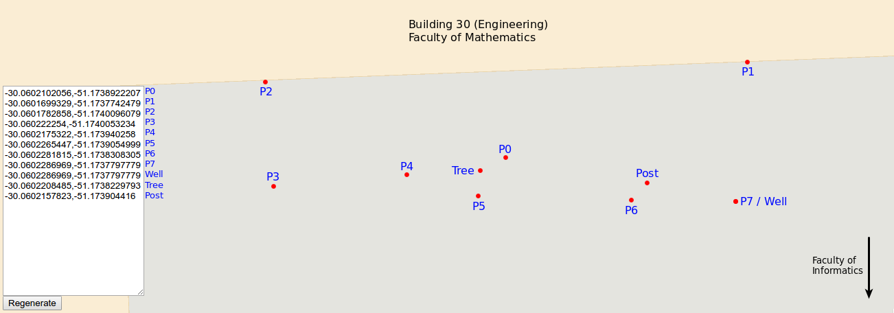
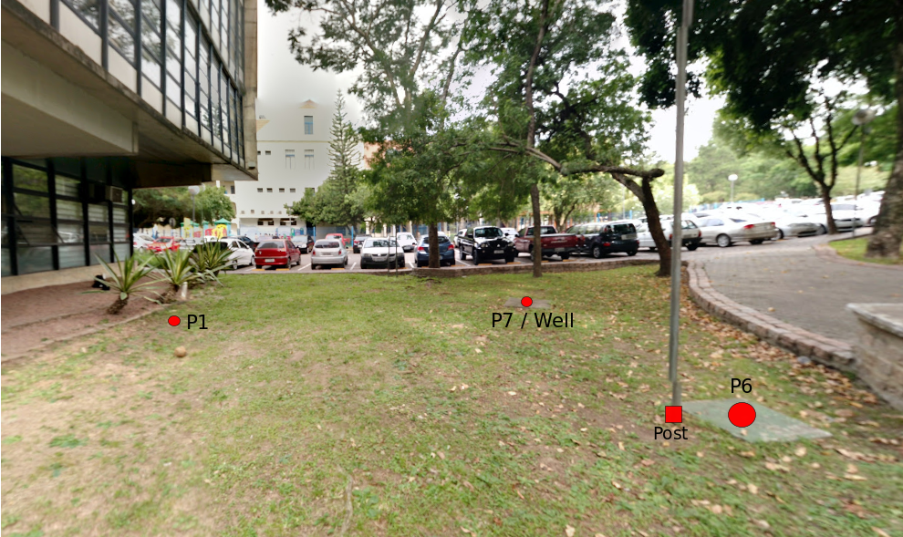
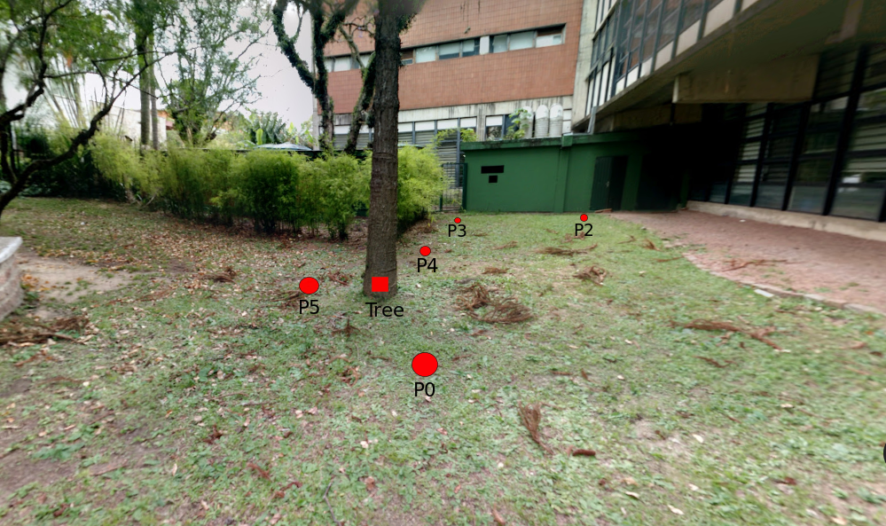

# Virtual Arena

This folder includes a text file with the global and local coordinates of the virtual delimiters of the competition's arena, and some obstacles found within it.

The global coordinates were trilaterated using the geoloc class described in the folder above. The local coordinates were obtained by converting the global coordinates to UTM and then subtracting them from the center coordinate. The three figures below provide intuition to the position of the delimiters and obstacles, in a map and in the real world.

